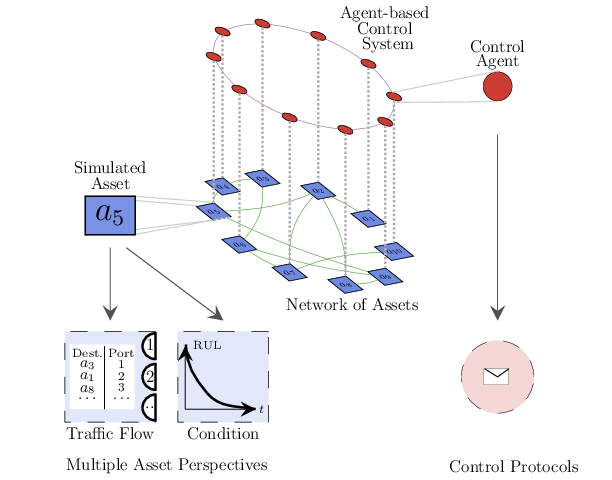

```@meta
CurrentModule = NAssets
```

# NAssets.jl (Networked Assets)



## Overview

`NAssets.jl` enables simulation of *Networked Assets* with a multi-model & multi-layer perspective. A `NAssets.jl` simulation is built from an *underlying network of assets* and a *control system*. The *control system* is built from agents, either one agent or multiple. In case of multiple agents, the control system is modelled as a *control network*. Hence, assets and control agent can have their own topology and characteristics.

### Underlying Network of Assets

Assets are connected according to a defined topology. Traffic is simulated to flow along the network according to the topology. Likewise, every asset deteriorates over time with implications in the traffic flow and the network dynamics. Moreover, arbitrary disruption events (e.g. dropping nodes) can be triggered. 

In `NAssets.jl` both nodes and links can be heterogeneous with different capacities or characteristics (e.g. deterioration functions). The assets are initially thought to be *Network Elements* of a telecommunication infrastructure, however, various characteristics, such as the dynamics of asset deterioration, is common to other type of networks.

 The assets in `NAssets.jl` are inspired by [OpenFlow](https://en.wikipedia.org/wiki/OpenFlow) switches and they route data packets across the network.The routing is done according to the packet forwarding tables that each asset holds. Each entry of this table is a *forwarding rule* indicates which `port` to use to forward an incoming packet with a given destination. For example, an asset `A3`, has a table with the pair `A5 - 1`, then it indicates that packets that `A3` receives with destination to asset `A5`, will be forwarded through `port` `1`. This port will lead directly or indirectly to `A5`, depending on the network topology.

### Control System Model

The control system is built from at least one *control agent*. Depending on the topology, one control agent can be responsible of controlling one or multiple assets. Control agents have responsibilities at different levels:

* Traffic flow operation: Control agents determine the path to use for packet routing and they install *forwarding rules* on the assets under control according to the paths. Path calculation requires two elements:

  * **A graph to calculate the path from.** This is the graph of the underlying network of assets. This graph is not the actual graph of the network of assets but *the graph known by the control system*. In the most complete case, a centralised control system with an individual agent will have full visibility of the underlying network. On the other side, in a *distributed control system* agents have partial/local visibility of the underlying network of assets and they exchange messages via the *control network* to collectively learn/discover the graph of the underlying network. The algorithm implemented for graph learning is based on a simple diffusion process [\[1\]](#1).

  
  * **An algorithm for path calculation**.  By default based on [Yen's shortest path algorithm](https://en.wikipedia.org/wiki/Yen%27s_algorithm) provided by [*Graph.jl*](https://github.com/JuliaGraphs/Graphs.jl) ecosystem. 
  

* Maintenance operation: Control agents monitor condition of assets, plan and trigger maintenance operations according to parameters defined. 


***

<a name="1">\[1\]</a> Babaoglu, Ozalp, et al. "Design patterns from biology for distributed computing." ACM Transactions on Autonomous and Adaptive Systems (TAAS) 1.1 (2006): 26-66. 

## Features

Multi-model simulation of networks of assets. Models currently supported are:

* **Asset Network Model** : Different off-the-shelf network topologies for asset connectivity. Integration with [Julia Graphs](https://juliagraphs.org/) ecosystem for functions generating random topologies plus ability to define own topologies passing the adjacency matrix as a csv file.

* **Agent Network Model**: NAssets.jl assumes agents are controlling the Asset Network. Agent-based model is built on top of [Agents.jl](https://juliadynamics.github.io/Agents.jl/stable/). Different off-the-shelf network topologies for agent network interaction are provided. Integration with Julia Graphs ecosystem for functions generating random topologies plus ability to define own topologies passing the adjacency matrix in a csv file.

* **Network Protocol Model**: `NAssets.jl` are also Network Elements able to route data packets across the network. NAssets.jl provide a minimal implementation of flow tables and control actions inspired by [OpenFlow](https://en.wikipedia.org/wiki/OpenFlow#:~:text=OpenFlow%20is%20a%20communications%20protocol,or%20router%20over%20the%20network.) protocol.

* **Physical Model**: NAssets.jl deteriorate along the time following a given deterioration function. Initially a simple linear function is used but other functions can be implemented and plugged into the model.

* **Maintenance Model**: Different maintenance strategies can be defined for the NAssets. For example, corrective and preventive.

* **Events Model**: NAssets.jl support scheduling of events for example starting a maintenance activity or randomly simulate failures in the network of assets. 

* **Geographical Model**: NAssets.jl are able to store geo-references. Initially simple coordinates are supported and used in plots and animations.

Models are defined in functions following the structure explained [here](structure.md).

## Installation

The package is in Julia's package list. Install it using this command:

```
using Pkg; Pkg.add("https://github.com/mperhez/NAssets.jl")
```

## Available Parameters

The full list of available parameters to configure `NAssets.jl` simulations is [here](parameters.md).

## Examples

* [Basic networked asset simulation](examples/example_1.md)


## API

Function documentation available [here](apidocs.md)

## Dependencies

[List of packages used by NAssets.jl](dependencies.md)

# Use Cases

* `NAssets.jl` can be used to simulate complex scenarios of traffic re-routing and network maintenance in digital network infrastructures. See for example [Integrating Asset Management and Traffic Engineering](https://www.youtube.com/watch?v=MDatb4EII7k)

# Contributors

* [Marco Perez Hernandez](https://marcoph.org)
* [Ajith Kumar Parlikad](https://www.ifm.eng.cam.ac.uk/people/aknp2/)
* [Manuel Herrera](https://www.ifm.eng.cam.ac.uk/people/amh226/)
* [Alena Puchkova](https://www.ifm.eng.cam.ac.uk/people/ap823/)


# Credits / Acknowledgement 

`NAssets.jl` was developed in the [Asset Management Group](https://www.ifm.eng.cam.ac.uk/research/asset-management/) of the [DIAL Laboratory](https://www.ifm.eng.cam.ac.uk/research/dial/) of the University of Cambridge. Initial development took place in the context of the [NG-CDI](https://www.ng-cdi.org/) programme funded by [BT](https://www.bt.com/) and [EPSRC](https://epsrc.ukri.org/).